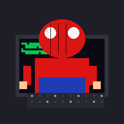

<h1 align="center">Victor Villafaña</h1>
<h3 align="center">Embedded Systems • Firmware • Real-Time Control</h3>

  

  

  

<h3 align="center">
  
</h3>

Soy estudiante de **Ingeniería Mecatrónica en el Instituto Politécnico Nacional**, enfocado en **Sistemas Embebidos, Firmware y Control en Tiempo Real**.

Me apasiona desarrollar soluciones donde el **hardware y el software trabajan juntos**, desde drivers bare-metal y RTOS hasta sistemas de adquisición de datos, automatización y visión por computadora.

* Actualmente trabajando con **STM32 (Bare-Metal)** y **ESP32**
* Desarrollando **drivers, librerías y firmware desde cero en C**
* Interesado en **RTOS, arquitectura ARM, VHDL y sistemas industriales**
* Buscando oportunidades como **Embedded / Firmware Engineer**
* Dato curioso: depurar registros y periféricos requiere un buen **sentido arácnido**

 

  

<h3 align="center">
  
</h3>

  

  

<h3 align="center">
  
</h3>

<table align="center">
<tr>
<td width="50%">

### Lectura ECG STM32

Monitoreo ECG en tiempo real usando **STM32F401**, procesamiento digital de señales y visualización en **Python**.

**Repositorio:** <a href="https://github.com/victor22-te/Lectura-ECG-STM32">Lectura-ECG-STM32</a>

</td>

<td width="50%">

### Portafolio RTOS & Bare-Metal

Programación **Bare-Metal en C para STM32F4**, incluyendo GPIO, EXTI, USART, SysTick y arquitectura ARM.

**Repositorio:** <a href="https://github.com/victor22-te/embedded-systems-rtos-stm32">embedded-systems-rtos-stm32</a>

</td>
</tr>

<tr>
<td width="50%">

### Control PID para Dron

Sistema de estabilización del ángulo de alabeo utilizando **ESP32 + MPU6050 + Control PID**.

**Repositorio:** <a href="https://github.com/victor22-te/Control-de-Alabeo-para-Dron">Control-de-Alabeo-para-Dron</a>

</td>

<td width="50%">

### Eye-Tracking Mouse

Control del cursor mediante **visión artificial y seguimiento ocular en Python**.

**Repositorio:** <a href="https://github.com/victor22-te/eye-tracking-mouse-control">eye-tracking-mouse-control</a>

</td>
</tr>
</table>

  

<h3 align="center">
  
</h3>

  

  

  

<h3 align="center">
  
</h3>

Mi objetivo es desarrollarme como **Firmware / Embedded Software Engineer**, participando en proyectos relacionados con:

* Sistemas embebidos
* Control en tiempo real
* IoT
* Automatización industrial
* Arquitectura ARM
* Desarrollo de drivers y RTOS

  

<h3 align="center">
  
</h3>

Si estás buscando a alguien apasionado por los **microcontroladores, firmware, automatización y sistemas embebidos**, estaré encantado de colaborar.

**"Tu amigable vecino desarrollador de embebidos"**

