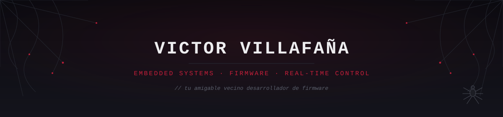
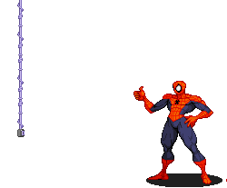

 

  

 

 

   
   &nbsp; <i>// quién soy</i>

Soy **Desarrollador de Firmware y Sistemas Embebidos**, próximo a graduarme como **Ingeniero Mecatrónico por el Instituto Politécnico Nacional**.

Me interesa el punto exacto donde **el hardware y el software se encuentran**: drivers bare-metal, RTOS, adquisición de datos, protocolos de comunicación y automatización industrial.

* Construyendo firmware bare-metal en **C para STM32 y ESP32**
* Escribiendo **drivers y librerías desde el registro**, sin depender de HAL cuando el proyecto lo permite
* Explorando **RTOS, arquitectura ARM y VHDL**
* Buscando oportunidades como **Embedded / Firmware Engineer**
* Dato curioso: depurar registros y periféricos requiere buen **sentido arácnido**

 

   <i>// lenguajes y herramientas</i>

 
 

 

   <i>// proyectos fijados</i>

<table>
<tr>
<td width="50%" valign="top">

### Lectura ECG STM32

ECG en tiempo real con **STM32F401**, filtrado DSP (notch y pasa-banda) y visualización en vivo en Python.

`STM32` `DSP` `Python`

→ <a href="https://github.com/victor22-te/Lectura-ECG-STM32">Lectura-ECG-STM32</a>

</td>
<td width="50%" valign="top">

### Bare-Metal & RTOS — STM32

Firmware en **C puro sobre STM32F4**: GPIO, EXTI, USART, SysTick y arquitectura ARM, construido desde el registro.

`C` `STM32F4` `ARM`

→ <a href="https://github.com/victor22-te/embedded-systems-rtos-stm32">embedded-systems-rtos-stm32</a>

</td>
</tr>
<tr>
<td width="50%" valign="top">

### Control de Alabeo — Dron

Estabilización de roll con **ESP32 + MPU6050**, implementando control PID en tiempo real.

`ESP32` `PID` `MPU6050`

→ <a href="https://github.com/victor22-te/Control-de-Alabeo-para-Dron">Control-de-Alabeo-para-Dron</a>

</td>
<td width="50%" valign="top">

### Eye-Tracking Mouse Control

Control de cursor mediante **seguimiento ocular y visión artificial con OpenCV**.

`Python` `OpenCV` `Accessibility`

→ <a href="https://github.com/victor22-te/eye-tracking-mouse-control">eye-tracking-mouse-control</a>

</td>
</tr>
</table>

 

 &nbsp; <i>// experiencia y proyectos industriales</i>

* **Desarrollador de Software** | *NTLINK Comunicaciones* (May. 2026 – Presente)
  *Desarrollo de herramientas y scripts para procesamiento y validación de CFDIs (Facturación Electrónica), automatización de procesos internos mediante PowerShell y gestión de comprobantes fiscales.*

* **Ingeniería de Control y Automatización** | *Fábrica de Velas "La Gloria"* (Jul. 2025 – Dic. 2025)
  * **Etiquetadora Industrial:** Diseño, arquitectura y programación desde cero de la lógica de control basada en PLC para la sincronización de sensores y actuadores.
  * **Empaviladora Automática:** Colaboración directa con ingeniería mecánica para la digitalización del sistema de control; migración completa de un sistema de lógica de relés a automatización por PLC.

 

   <i>// actividad</i>

  

  

 

   <i>// hacia dónde voy</i>

Mi objetivo es desarrollarme como **Firmware / Embedded Software Engineer**, participando en proyectos relacionados con sistemas embebidos, control en tiempo real, IoT, automatización industrial, arquitectura ARM y desarrollo de drivers y RTOS.

 

   <i>// redes y contacto</i>

  

Si buscas a alguien con pasión por **microcontroladores, firmware y sistemas embebidos**, hablemos.

<i>"Tu amigable vecino desarrollador de embebidos."</i>

  

  

